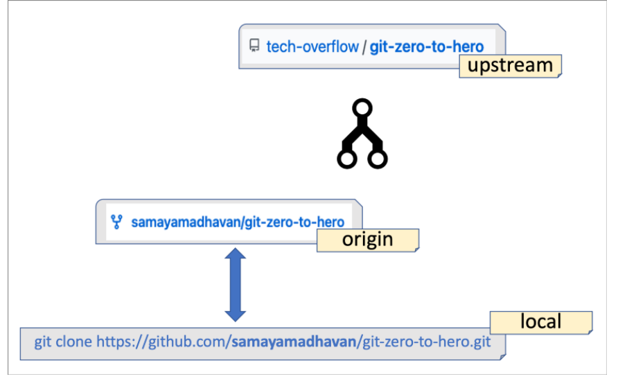

# Git bash commands

### To initialize git repository in selected folder

```
    open git bash in that folder then
    git init
```

### to add name and email
```
    git config --global user.name user_name
    git config --global user.email mailtomohit2002@gmail.com
```

### to show all the files
```
    ls
```

### Staging a file for tracking using git

```
    git add file_name.ext
```

### for adding all the files of the respective folder to the staging level

```
    git add file_name.ext -A
```

### to find the status i.e. which file has been changed (modified) from staging level to staging level
```
    git status
```

### Status in Short
```
    git status -s
```


***this means that the file has been modified in the working area and now is in the modified level***

---

***after add to the staging level using add git command***

---


### to recover the previous code (last commit code) for a particular file

```
    git checkout file_name.ext
```

### to recover the previous code for all the files of the directory

```
    git checkout -f
```


### to show all the files and  hidden item of the folder using git bash use

```
    ls -lart
```


### to create a blank file using git bash
```
    touch file_name.ext
```

### to check the commits made using git bash
```
    git log
```

### to check the last n commints
```
    git log -p -n
```
### to compare the staging area with the working area
```
    git diff 
```

### to compare the staging area with the last commit
```
    git diff -- staged
```

### to commit the files without adding to the staging area
```
    git commit -a -m 
```
### to get the list of all the commits
```
    git reflog
```


### to recover the code from any specific commit
```
    git reset --hard commit_code(yellow thing in above pic)
```

## Deleting files 
---
### deleting from working directory and the staging area
```
    git rm
```
### deleting from staging area only
```
    git rm --cached
```
---

## Creating Branches
creating new branch
```
    git branch branch_name
```
checking the names of all the branches
```
    git branch
```
Switching to different branch
```
    git checkout branch_name
```

* Changes done in any particular branch will not be reflected until we **merge that branch with the master branch** using the following:-

```
    1. Go to the branch where you want to merge respective branch
    using git checkout branch_name
    2. git merge branch_tomerge_name
    
```
## Important!
```
    1. If you add any file in any particular branch and then shift to another branch then that file will not be created in that branch.
```


---


### to commit for individual files

```
    USING VIM EDITOR
        1. git commit file_name.ext
        2. press i
        3. enter the message 
        4. enter esc
        5. :wq to exit the vim editor
        6. congo! changes would be saved for your file
```    
```
    USING Commit -m "message"
        
        git commit file_name.ext -m "message for commit"
```
---
## Creating a gitignore file
`A gitignore file consists of the names of all the files that we want git to ignore completely.`
```
    touch .gitignore
```
### to ignore only the files in the directory of gitignore only then write the following in gitignore
* **/file_name.ext**

### to ignore all the files with extension .ext write the following
* ***.ext**
---


---
# STEPS PORTION STARTS FROM HERE

### to save any change made with any file we have to follow the following sequence:-
    1. add the file to the staging level.
    2. do the changes you want to bring in your files.
    3. then commit to create the snapshot or save the changes.
    4. on commiting the files comes to the unmodified mode and from there it can either be removed from tracking or further changed.

### to start the traking of our project at least once we need to do commit at least once (called initial commit){
    1. git commit
    2. vim editor opens
    3. press i
    4. Initial commit
    5. enter esc
    6. :wq to exit


### alternate way 
    git commit -m "message to pass"


# Dealing with Github
` To add a local repository to your github library of repositories follow the steps:-`
```
    1. Go to your github account and create a new repository with desired name.

    2. git remote add origin https://github.com/ThisisMS11/git-and-github-with-codewithharrry.git

    Use the above remote thing and paste on git bash terminal here 'origin' acts as the alternate name for your url.

    **remote is nothing but the url where you want to push your repository**

    3.git remote
        to check your url alternate name

    4. git push url_name(origin here) branch_name 
        git push origin master
```
> :warning: **The above steps were for HTTP, it somehow worked without asking for ssh key but if we want to use ssh to push our local repository we need to use ssh key**

To see your git push url
```
    git remote -v
```

To change the URL
```
    git remote set-url origin new_url
```

## Creating a ssh key
1. Go to personal settings icon
---


2. SSH keys and GPG keys
3. generating ssh keys
4. Generating a new SSH key and adding it to the ssh-agent
Now put the following commands in gitbash

1. ssh-keygen -t ed25519 -C "your_email@example.com"
2. eval "$(ssh-agent -s)"
3. cat ssh-add ~/.ssh/id_ed25519

it will generate a key now go to add ssh key and add it there


4.now run this command
```
    git push -u origin branch_name
```

> If you push your repo to github and then make some changes in it and commit it even then those changes will not be reflected at your github repository but if you want to reflect them then you will again have to push the repo to github using the same above command.

## merging branches
> switch to that branch and use the same 'git push -u origin branch_name'

---

# Cloning a project
1. Go to that public repository and copy the url.
2. Select the folder where you want to clone the repo and then put the following in git bash.
```
    git clone url_here folder_name
```
>if you do not put folder_name then it will create the folder with the name of repo itself.

# Rewriting git history

## 1. Amending commits
> If you have added some new files and they are not staged and you don't want a seperate commit for the new files and want to merge that thing with the last commit then that's where amend comes into picture

```
1. git add -A  {stage the new files}
2. git commit --amend --no-edit  
   {to merge the staging with the last commit}.
3. The only change would be that the id of the last commit would get changed.
```


## 2. Rewording-commits
> If you want to rewrite some commits then follow the steps :
```
1. git rebase -i HEAD~n  {to select the last n commits for edit}.

2. Now your default text editor (vim) would get opened.

3. press i to do any changes.

4. now change the 'pick' to 'reword' in front of commits you want to reword among the selected n commits.

5. Esp : wq

6. Now another vim window will get opened , press i and edit the message.

7.  Esp : wq

8. Commits would have reworded.
```

## 3. Deleting commits
```
1. git rebase -i HEAD~n  {to select the last n commits for edit}.

2. Now your default text editor (vim) would get opened.

3. press i to do any changes.

4. now change the 'pick' to 'drop' in front of commits you want to reword among the selected n commits.

5. Esp : wq

6. The selected commits would have got dropped.
```

## 4. Reordering commits
```
1. git rebase -i HEAD~n  {to select the last n commits for edit}.

2. Now your default text editor (vim) would get opened.

3. press i to do any changes.

4. Now you just need to manually change the order of your commits like copy and pasting as per your desired sequence.

5. Esp : wq

6. Your order would have got changed.
```

## 4. Squasing commits with 'fixup'
> If you want some commits to get merged into one then that's where squashing comes into picture it is useful when you want to remove some unnecessary commits and merge those into one.
```
1. git rebase -i HEAD~n  {to select the last n commits for edit}.

2. Now your default text editor (vim) would get opened.

3. press i to do any changes.

4. change 'pick' to 'fixup' in front of the commits you want to merge.

5. Esp : wq
```

## 5. Splitting the commits
> Sometimes you want some commits to be described in more detail so there we can use splitting.
```
1. git rebase -i HEAD~n  {to select the last n commits for edit}.

2. Now your default text editor (vim) would get opened.

3. press i to do any changes.

4. now change 'pick' to 'edit' for the commit which you want to split 
.

5. Esp : wq

6. Now git will open a new rebasing branch in the terminal.

7. git reset HEAD^ {to unstage all those files which were involved for selected commit}

8. Now individually you can stage the files and commit the message in your desired sequence.

9. git rebase --continue {git will continue the rebasing process}

10. Now you will find yourself at the default feature branch.

11. Esp : wq
```


# Done !😊


    